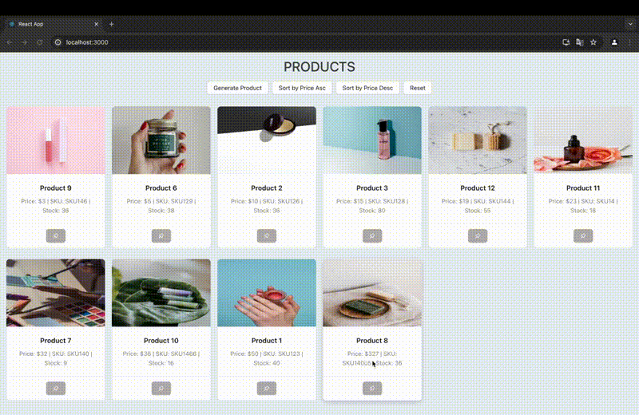

# Mock Production

Application that includes a backend server, a frontend interface, and utilizes a PostgreSQL database. The application will manage a catalog of mock products, allowing users to sort, pin, and view these products.

## Application


## Installation

Use the package manager [npm](https://www.npmjs.com) to install node modules.

```bash
cd Frontend
npm install 
```

```bash
cd Backend
npm install 
```
##### Frontend:
```bash
cd Frontend
npm start 
```
##### Backend:
```bash
cd Backend
npm run start 
```
## Docker

```bash
docker-compose up --build
```

## Usage

```text
# Mock Production

Application that includes a backend server, a frontend interface, and utilizes a PostgreSQL database. The application will manage a catalog of mock products, allowing users to sort, pin, and view these products.

## Application


## Installation

Use the package manager [npm](https://www.npmjs.com) to install node modules.

```bash
cd Frontend
npm install 
```

```bash
cd Backend
npm install 
```
##### Frontend:
```bash
cd Frontend
npm start 
```
##### Backend:
```bash
cd Backend
npm run start 
```
## Docker

```bash
docker-compose up --build
```

## Usage

```text
## Running the Application

To run the application, execute the following command:

docker-compose up --build

Upon completion of the build, navigate to localhost:3000 in your web browser. As there are no products in the database initially, you won't see any data displayed.

Clicking the Generate button will open a dialog where you can input the product details:

- Example:
  - Product Name: Product 1
  - Price: (Accepted as an integer value)
  - SKU: SKU123 (Accepted as a unique value)
  - Stock Level: 50

Clicking the Submit button will save the product.

For visual appeal, 12 default product images have been included within the project.

### Possible Errors ###

If the Product table is not automatically populated upon completion of the build, follow these steps:

1. Access the pgAdmin panel at localhost:5050.
   - Email: admin@admin.com
   - Password: pgadmin4

2. Right-click on the Server and select Register > Server.
   - General:
     - Name: Test
   - Connection:
     - Host: db
     - Port: 5432
     - Database: postgres
     - Password: postgres


```

## Contributing

Pull requests are welcome. For major changes, please open an issue first
to discuss what you would like to change.

Please make sure to update tests as appropriate.


## Stay in touch

- Author - [Melis Keşen](https://www.linkedin.com/in/meliskesen/)
- Website - [https://melis-kesen.github.io/Portfolio/](https://melis-kesen.github.io/Portfolio/)

## License


```

## Contributing

Pull requests are welcome. For major changes, please open an issue first
to discuss what you would like to change.

Please make sure to update tests as appropriate.


## Stay in touch

- Author - [Melis Keşen](https://www.linkedin.com/in/meliskesen/)
- Website - [https://melis-kesen.github.io/Portfolio/](https://melis-kesen.github.io/Portfolio/)

## License
